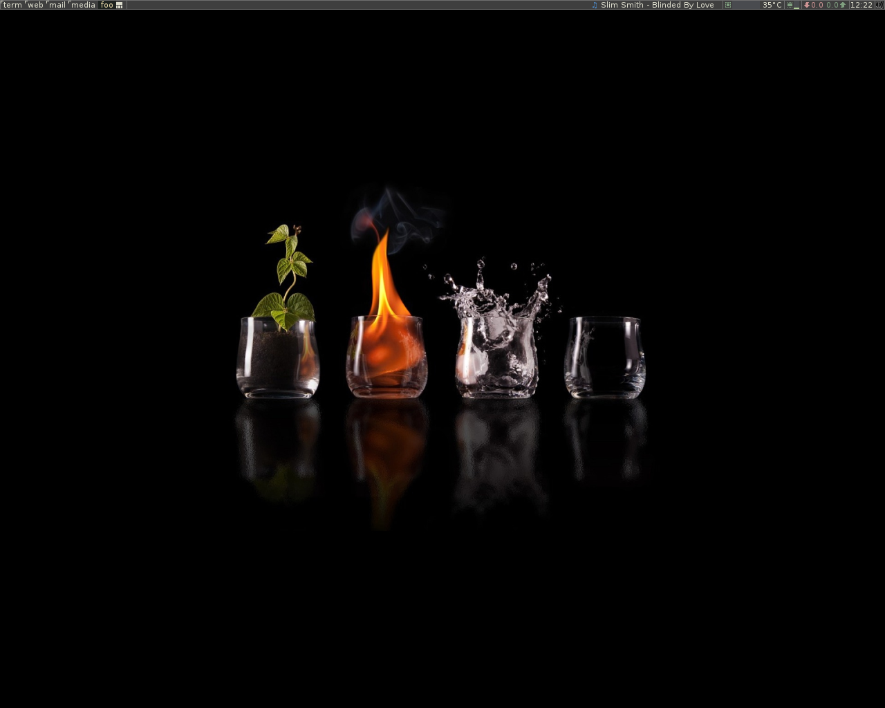

# Awesome wm configuration file



## Dependencies

You need to have `mocp` running as a server.

Launching `volumeicon` will display a volume widget.

Lastly `xcompmgr` will prevent a bug of chromium redrawing on other tags.

Add the following to you `~/.xinitrc`:

```
xcompmgr &
mocp -S &
volumeicon &
```
